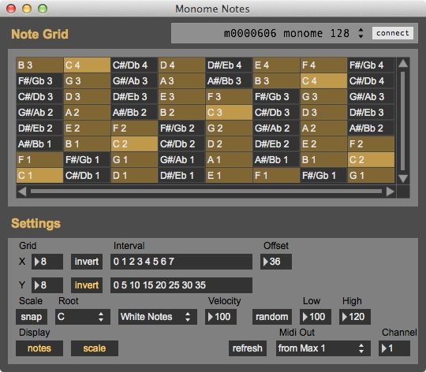
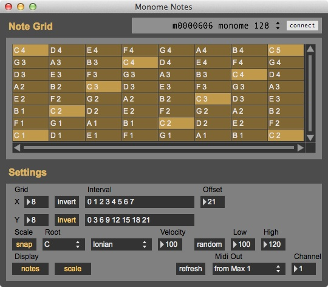

# monome-notes

By: myr

monome notes is an app for playing midi notes on a grid device. it turns each key on the grid into a midi note which you can trigger by pressing the key, similar to a keyboard or drum pad. the app allows you to control the way the notes are laid out and displays information about the current note layout on the leds.

it's kind of like a guitar fretboard, where you can change the tuning between strings, change the distance between frets and even snap it to play in a scale; all the while the fretboard can light up to show you whatever scale you select.

you set the interval between each column and row in semitones (or scale degrees if snapped to scale), relative to the first note in the grid. the first note in the grid is set by the offset number. you can set a scale using the drop down menu, set the root note for this scale to start on and snap to the scale eliminating all non-diatonic notes from the grid.

i've attached two images to this post, the first shows the default setup, it's kind of like a bass guitar fretboard with the interval between columns set to 1 semitone and the interval between rows set to a perfect fourth or five semitones. 

the second image shows an ableton push style setup, with the scale snapped to C Ionian (Major) a semitone between columns and three semitones between rows.

here's a quick tester of what i've got so far, lots more stuff on the way and tidying up to be done in the code; chiefly presets and lighting up what notes are being played on the grid. currently designed for varibrightness monome grids, not sure if the leds will work on older models. requires max 6. hope you enjoy it.